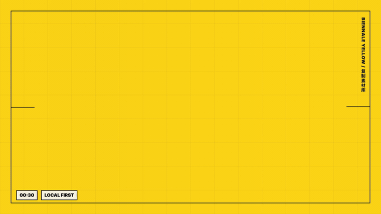

# ClipShelf · 复制素材库

**一个 macOS 侧边栏复制素材库：自动汇总你按过 `Command + C` 的文字、链接和图片，保留来源链接或截图，并支持编辑后保存到 Obsidian。**

> A context-aware shelf for everything you copy.

每天复制的信息太多，很容易忘记“这段话是从哪个网页、哪个 App、哪个上下文里复制来的”。ClipShelf 会把复制过的内容先自动收进本地侧边栏收藏夹：你可以搜索、预览、二次编辑，确认有用后再一键保存到 Obsidian 的「复制素材库」里。

## 效果演示



[观看 30 秒高清双语介绍视频 / Watch the 30s HD intro video](docs/videos/clipshelf-intro.mp4)

## 适合谁

- 经常复制文章素材、网页链接、图片、产品案例、聊天片段的人。
- 写作、研究、产品分析、内容创作时，需要把零散素材沉淀到 Obsidian 的人。
- 不想让剪贴板只记住最后一次复制，而是想保留一段时间内复制记录的人。

## 核心能力

- **自动收集复制内容**：文字、URL、图片都会进入本地收藏夹。
- **保留复制上下文**：记录来源 App、复制时间、窗口标题、网页链接；链接读取不到时，用截图作为上下文补充。
- **二次编辑再保存**：保存到 Obsidian 前，可以先改标题、分类和正文。
- **一键入库 Obsidian**：把有用素材写入本地 Obsidian Vault 的「复制素材库」项目库。
- **侧边栏高效操作**：支持搜索、筛选、预览、删除、清空、暂停捕捉和刷新。
- **本地优先**：没有账号、没有云同步、没有遥测，复制记录保存在你的电脑上。

## 核心技术亮点

- **Electron desktop shell**：用 Electron 构建 macOS 桌面应用，包含主窗口、悬浮入口和菜单栏能力。
- **React + TypeScript renderer**：前端界面使用 React/TypeScript 实现，负责素材列表、筛选器、预览区和保存弹窗。
- **Main / Preload / Renderer IPC bridge**：通过 Electron `ipcMain`、`ipcRenderer` 和 `contextBridge` 把系统能力安全暴露给 UI。
- **System clipboard polling**：主进程轮询系统剪贴板，捕捉文本、链接和图片。
- **Signature-based deduplication**：用内容签名去重，避免同一段文字或同一个链接被重复收集。
- **Source context capture**：使用 `desktopCapturer` 生成窗口缩略图；通过 macOS Automation/AppleScript 尝试读取浏览器当前 URL。
- **Local JSON persistence**：本地 JSON 持久化保存历史记录、素材路径、截图路径、来源信息和保存状态。
- **Obsidian Markdown export**：将编辑后的素材生成 Markdown 笔记，写入 Obsidian Vault，并复制图片/截图附件。
- **Retention cleanup**：默认保留 7 天未保存历史，自动清理过期暂存记录。

## 交互流程

1. 打开 ClipShelf，悬浮按钮会停在屏幕侧边。
2. 在任何 App 里按 `Command + C` 复制文字、链接或图片。
3. 复制内容自动进入侧边栏收藏夹，并附带来源、时间、链接或截图。
4. 点击某条素材，可以查看完整内容和复制位置。
5. 保存前可以二次编辑正文、项目和分类。
6. 点击保存，素材会写入 Obsidian 的「复制素材库」。
7. 遇到敏感内容时，可以随时暂停捕捉，也可以清空本地暂存记录。

## 下载 Mac App

普通用户不需要下载源码。正式使用时，请到 GitHub 右侧或顶部的 **Releases** 页面下载：

```text
ClipShelf-mac-arm64.zip
```

下载后解压，双击 `ClipShelf.app` 即可打开。由于当前 MVP 版本还没有 Apple Developer 签名和 notarization，第一次打开时 macOS 可能会提示无法验证开发者。可以右键点击 `ClipShelf.app`，选择 **Open / 打开**，再确认打开。

开发者如果想自己生成安装包，可以运行：

```bash
npm run package:mac
```

生成的文件会在：

```text
release/ClipShelf-mac-arm64.zip
```

## 本地运行

### 环境要求

- macOS
- Node.js 20+
- npm
- Obsidian，可选；只有保存到 Obsidian 时需要

### 开发模式

```bash
npm install
npm run dev
```

### 创建桌面启动器

```bash
npm run build
npm run make-launcher
```

执行后会在桌面生成 `复制素材库.app`。以后双击它，就可以打开悬浮入口；点击「复制库」或底部箭头，可以展开完整侧边栏。

## Obsidian 配置

默认会查找这个 Obsidian Vault：

```text
~/Documents/Obsidian Vault
```

也可以用环境变量指定自己的 Vault：

```bash
CLIPBOARD_OBSIDIAN_VAULT="/path/to/your/vault" npm run dev
```

保存后的结构：

```text
复制素材库/
  复制素材库.md
  素材/
  附件/
```

每条保存的复制素材都会生成一篇独立 Markdown 笔记，并被索引到 `复制素材库.md`。

## macOS 权限

基础剪贴板捕捉不需要额外配置，只要 App 正在运行即可。

为了保留更完整的来源上下文，macOS 可能会请求：

- **Screen Recording**：用于保存复制时的窗口截图或屏幕缩略图。
- **Automation**：用于读取 Chrome、Arc、Edge、Brave、Vivaldi 或 Safari 当前网页链接。

如果你拒绝权限，ClipShelf 仍然可以收集复制内容，只是网页链接或截图可能显示为空。

## 隐私说明

剪贴板里可能有非常私密的内容，所以 ClipShelf 当前版本坚持本地优先：

- 不创建账号。
- 不上传复制内容。
- 不包含数据分析或埋点。
- 不做云同步。
- 本地暂存记录默认 7 天后清理。
- 保存到 Obsidian 的内容只写入你的本地 Vault。

更多说明见 [PRIVACY.md](PRIVACY.md)。

## 常用命令

```bash
npm run dev           # 启动开发环境
npm run build         # 类型检查并构建前端
npm run typecheck     # 只运行 TypeScript 检查
npm run start         # 用 Electron 启动已构建应用
npm run make-launcher # 在桌面创建 macOS 启动器
```

## 项目结构

```text
electron/       Electron 主进程和 preload bridge
src/            React/TypeScript 界面
scripts/        开发启动和 macOS 桌面启动器脚本
docs/           发布说明、演示图和项目文档
dist/           构建产物，默认不提交
```

## Roadmap

- 首次启动时选择 Obsidian Vault。
- 打包 `.dmg`，让非开发者也能直接安装。
- 增加全局快捷键，快速展开或隐藏侧边栏。
- 更细粒度的敏感内容暂停模式。
- 可选的分类规则和自动归档策略。
- 本地历史的导入/导出工具。

## Contributing

欢迎提交 Issue 和 Pull Request。反馈问题时，请不要上传真实剪贴板记录、私人截图、个人链接或 Obsidian 笔记原文。

## License

MIT
